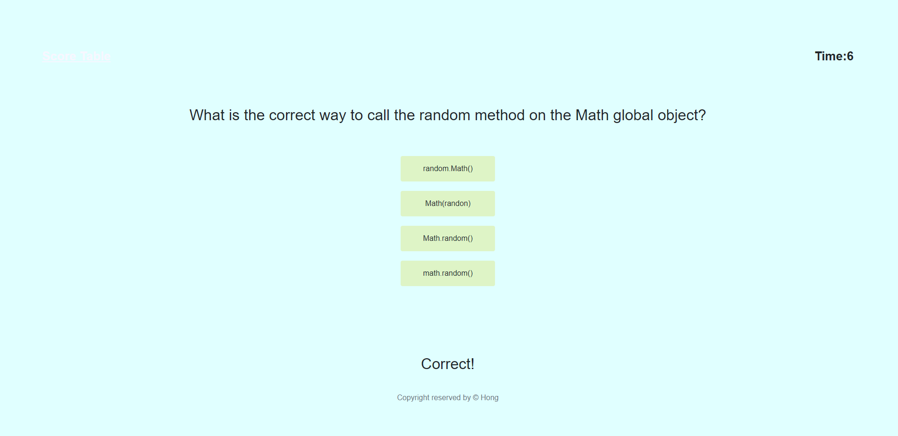
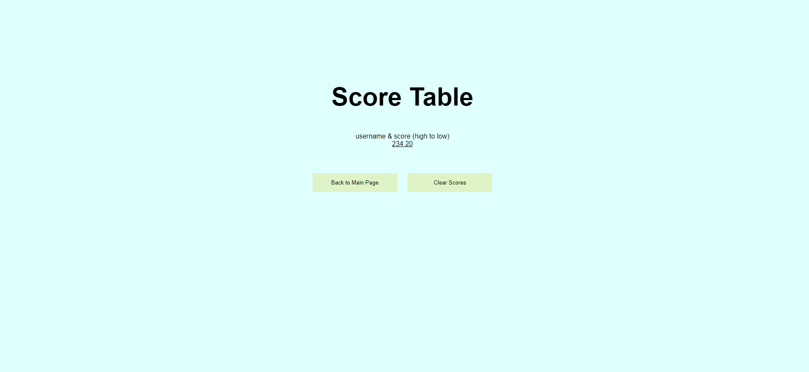

# Time Based Code Quiz for 04 Web APIs: Code Quiz

# [Web Link](https://hongnodie.github.io/Time-Based-Code-Quiz/)
# [Github Repo](https://github.com/Hongnodie/Time-Based-Code-Quiz.git)

A timed quiz application with multiple choice questions on JavaScript fundamentals that stores high scores for users to gauge progress compared to peers

## About the Project

As I proceed in my career as a web developer, I will probably be asked to complete a coding assessment. These assessments are typically a combination of multiple-choice questions and interactive challenges. As a bootcamp student, I want to build a code quiz application with multiple-choice questions on JavaScript that stores high scores so I can gauge my progress compared my peers. 

## Client's Requirements

Initial design of the app has the following deliverables:

GIVEN I am taking a code quiz
WHEN I click the start button
THEN a timer starts and I am presented with a question
WHEN I answer a question
THEN I am presented with another question
WHEN I answer a question incorrectly
THEN time is subtracted from the clock
WHEN all questions are answered or the timer reaches 0
THEN the game is over
WHEN the game is over
THEN I can save my initials and my score

## Demo

## Screenshot

